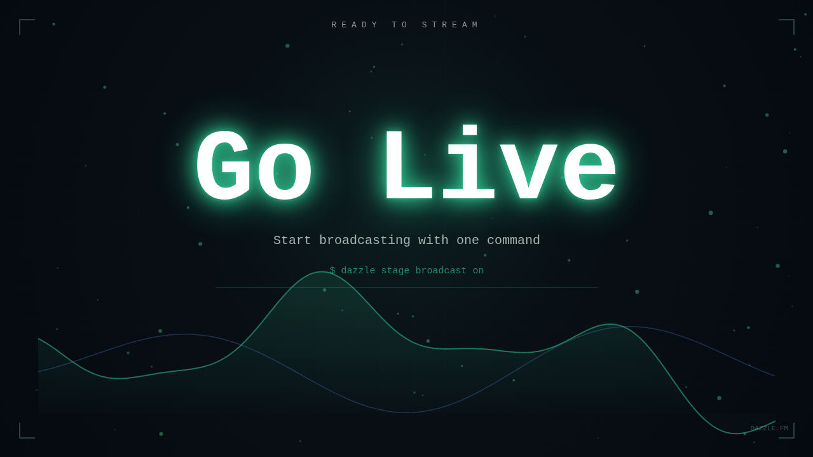

# Dazzle Stream Examples

Runnable examples for [Dazzle](https://dazzle.fm) — cloud stages that render and broadcast your content as a live stream.



## Examples

| Example | Description |
|---------|-------------|
| [`hello-world`](./hello-world) | 5 cinematic scenes — particles, terminal, pipeline, kinetic typography, waveform. React/TypeScript/Tailwind with Canvas 2D backgrounds. |
| [`remotion-stream`](./remotion-stream) | Motion graphics with Remotion — signal lock, counting numbers, waveforms, typewriter, orbital particles. Spring physics and hard-cut transitions. |
| [`claude-code-stream`](./claude-code-stream) | Live visualization of a Claude Code session. Every tool call, file edit, search, and agent spawn on stream in real time. Installable as a skill. |

## Quick Start

```bash
# Install Dazzle
curl -sSL https://dazzle.fm/install.sh | sh
dazzle login

# Create a stage
dazzle stage create my-stage

# Pick an example, build, sync
cd hello-world && npm install && npm run build && cd ..
dazzle stage sync ./hello-world/dist --stage my-stage
```

Broadcasting starts automatically when the stage activates.

## How It Works

```
Your Code  →  npm run build  →  dazzle stage sync  →  Cloud Browser  →  Live Stream
(React/TS)     (dist/)            (CLI)                 (1280x720)        (Kick/Twitch/YT)
```

Build a web app. Dazzle syncs it to a cloud browser at 1280x720, captures at 30fps, broadcasts the output. React, Canvas 2D, SVG, Web Audio — all work.

## Key Constraints

- **1280x720** fixed resolution, 30fps capture, software renderer
- **CSS animations and Canvas 2D** are the sweet spot — no heavy shaders
- **Full viewport, no scroll** — 16:9 with 40px safe area
- Every CLI command uses `--stage` explicitly

See `dazzle guide` or [dazzle.fm/guide.md](https://dazzle.fm/guide.md) for the full authoring guide.

## Links

- [Dazzle](https://dazzle.fm)
- [CLI source](https://github.com/dazzle-labs/cli)
- [Content guide](https://dazzle.fm/guide.md)
- [LLM reference](https://dazzle.fm/llms.txt)
