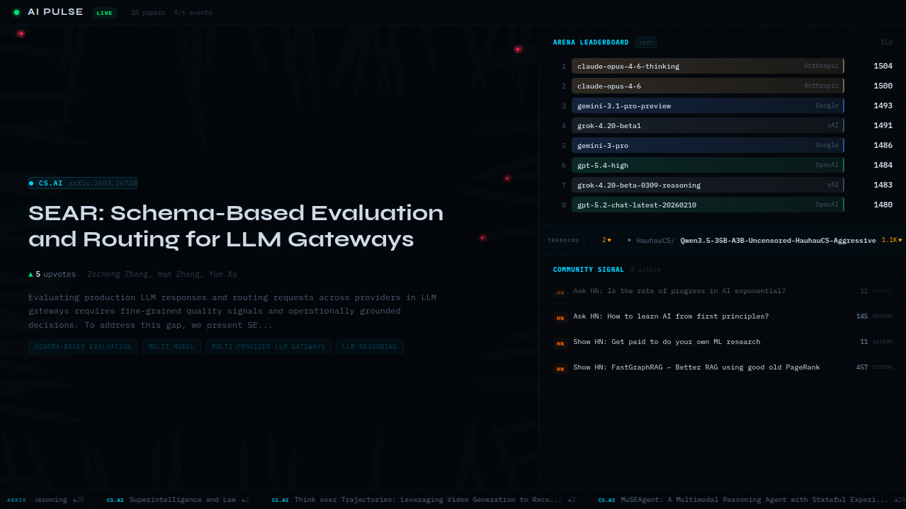

# ai-pulse

Real-time AI/ML ecosystem intelligence stream. Visualizes trending papers, model leaderboards, GitHub activity, and community discussion as a living broadcast.



## Data Sources

The stage consumes 26 verified data sources across 4 tiers:

**Tier 1 (free, no auth):** Hugging Face Daily Papers, HF Trending Models, ArXiv RSS, Arena AI Leaderboard, Hacker News Algolia, Wikipedia EventStream, Bluesky Jetstream, Mastodon Streaming

**Tier 2 (free, optional auth):** Semantic Scholar, Artificial Analysis, GitHub Events/GraphQL, HF Dataset Viewer, Finnhub stocks, Reddit

**Tier 3 (paid inference):** Groq (text at 1000 tok/s), fal.ai (images under 1s), Claude (reasoning + PDF), OpenAI (image generation)

**Tier 4 (ambient):** AI company blog RSS feeds, newsletter RSS, Stack Overflow, Kaggle leaderboards

Full endpoint documentation, auth requirements, and rate budgets in [PLAN.md](PLAN.md).

## Run

```
npm install
npm run dev
```

## Stage Architecture

**Left panel:** Canvas 2D particle system as atmospheric backdrop. Five particle types (paper/commit/star/social/release) with distinct colors and glow sprites rendered via additive blending. Paper hero overlays the canvas with a decode-text animation that resolves character by character.

**Right panel:** Arena AI ELO leaderboard with animated bars and vendor colors. Scrolling model ticker. Community signal feed aggregating HN, Bluesky, Mastodon, and Reddit.

**System bar:** LIVE indicator, event rate counter, AI stock ticker (NVDA, AMD, MSFT, GOOG, META).

**Paper ticker:** Scrolling ArXiv submissions color-coded by category (cs.AI, cs.LG, cs.CL, cs.CV, stat.ML).

## Feeder Integration

The stage listens for `ai-pulse-data` CustomEvents from the Dazzle feeder:

```
dazzle stage event emit ai-pulse-data '{"type":"paper","paper":{...}}'
dazzle stage event emit ai-pulse-data '{"type":"leaderboard","entries":[...]}'
dazzle stage event emit ai-pulse-data '{"type":"social","post":{...}}'
dazzle stage event emit ai-pulse-data '{"type":"activity","event":{"kind":"commit","label":"..."}}'
```

Runs standalone with demo data when no feeder is connected.

## PDF Strategy

Three verified paths for reading papers:

1. **ArXiv HTML** (`https://arxiv.org/html/{id}`): clean HTML for most AI/ML papers, no parsing needed
2. **Claude native PDF**: send PDFs directly to the API as document content blocks (up to 600 pages)
3. **unpdf npm package**: server-side extraction fallback
