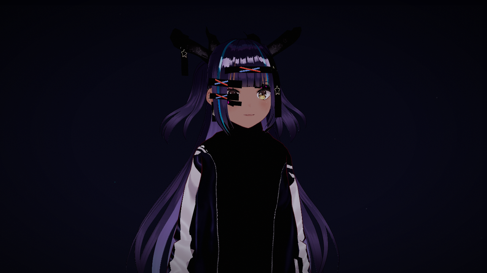

# ai-vtuber

AI VTuber live stream. A 3D anime character speaks, emotes, and reacts on a Dazzle stage, powered by Claude for conversation and [Kokoro TTS](https://github.com/hexgrad/kokoro) for voice synthesis. Control the character live via Dazzle events, or let it monologue on its own.

Works out of the box with zero configuration.



## Quick start

```bash
npm install
npm run dev
```

No API keys required. A default VRM model is fetched automatically, and the character speaks built-in idle phrases with Kokoro TTS.

## Deploy to Dazzle

```bash
npm run build
dazzle stage create ai-vtuber --gpu
dazzle stage up --stage ai-vtuber
dazzle stage sync ./dist --stage ai-vtuber
```

GPU stage required for VRM rendering + Kokoro TTS (WebGPU).

## Configuration

| Variable | Description | Default |
|----------|-------------|---------|
| `VITE_VRM_MODEL_URL` | URL or local path to a VRM model | CC0 sample from GitHub |
| `VITE_LLM_API_KEY` | API key for AI conversation (OpenRouter, OpenAI, etc.) | Built-in idle phrases |
| `VITE_LLM_API_BASE` | Base URL for the chat completions API | `https://openrouter.ai/api/v1` |
| `VITE_LLM_MODEL` | Model identifier | `anthropic/claude-haiku-4.5` |

Set in a `.env` file. Any OpenAI-compatible API works (OpenRouter, OpenAI, Together, etc.). Create custom VRM models with [VRoid Studio](https://vroid.com/en/studio) (free).

## Events

Control the character live:

```bash
# Say text with emotion
dazzle stage event emit say '{"text":"Hello!","emotion":"happy"}' --stage ai-vtuber

# Ask the AI to respond (requires API key)
dazzle stage event emit ask '{"prompt":"What do you think about music?"}' --stage ai-vtuber

# Change topic for idle monologue
dazzle stage event emit topic '{"topic":"the beauty of fractals"}' --stage ai-vtuber

# Switch VRM model
dazzle stage event emit switch-model '{"model":"avatar_a"}' --stage ai-vtuber
```

Emotions: `neutral`, `happy`, `sad`, `surprised`, `angry`, `thoughtful`, `curious`.

When idle for 30 seconds with no events, the character speaks automatically.

## How it works

- **VRM rendering**: Three.js + @pixiv/three-vrm, auto camera framing, three-point lighting, spring bone physics
- **Animation**: VRMA idle loop for body movement, procedural auto-blink (sine curve, 15% double-blink), eye saccades with probability-weighted intervals
- **Expressions**: Layered emotion blending (e.g., happy = 0.7 happy + 0.2 mouth open) with eased transitions
- **Lip sync**: Text-driven viseme mapping synced to TTS audio duration
- **TTS**: Kokoro 82M running in a Web Worker (WebGPU), audio captured by Dazzle's PulseAudio
- **Conversation**: Event-driven dialogue queue with idle fallback. Optional Claude API for AI responses.

## Credits

- [@pixiv/three-vrm](https://github.com/pixiv/three-vrm), [moeru-ai/airi](https://github.com/moeru-ai/airi), [Kokoro](https://github.com/hexgrad/kokoro), [Anthropic Claude](https://docs.anthropic.com/)
