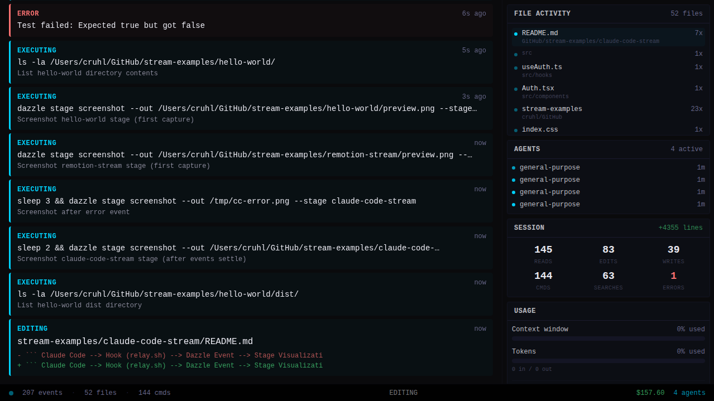

# Claude Code Stream

Live visualization of an AI coding agent at work. Every tool call -- file reads, edits, bash commands, grep searches, subagent spawns -- appears on a Dazzle stage in real time, the moment it happens. Your audience watches the AI think.

This is the one you want to show people.



## How It Works

```
Claude Code  -->  Hook (relay.sh)  -->  Dazzle Event  -->  Stage Visualization
(tool call)       (extracts data)       (dazzle stage      (renders on stream)
                        |                event emit)
                        |
                        +------------>  Local Bridge   -->  Vite Dev Server
                                        (localhost:7777     (localhost:5173)
                                         WebSocket)
```

Claude Code fires hooks on every tool use. The relay script (`relay.sh`) reads the hook payload from stdin, extracts the tool name, file path, command, search pattern, or agent info, then pushes a structured event to your Dazzle stage via `dazzle stage event emit`. The visualization is a React/TypeScript/Tailwind app that listens for those events and renders them in a two-column layout: a scrolling event feed on the left and sidebar panels on the right. Tool starts appear immediately; tool completions update with success/failure status and result previews.

## Prerequisites

- [Dazzle CLI](https://dazzle.fm) -- `curl -sSL https://raw.githubusercontent.com/dazzle-labs/stream-examples/main/install.sh | sh`
- [jq](https://jqlang.github.io/jq/) -- `brew install jq` (macOS) or `apt install jq` (Linux)
- [Claude Code](https://claude.ai/claude-code) -- Anthropic's CLI for Claude

## Quick Start

### Option A: Install the Skill (recommended)

Install the Claude Code skill, then invoke it from any project:

```bash
/claude-code-stream
```

The skill walks you through every step: checking prerequisites, creating or choosing a stage, syncing the visualization, configuring hooks with the correct absolute paths, taking a screenshot to verify, and starting the broadcast. You don't need to touch any config files by hand.

### Option B: Manual Setup

```bash
# 1. Create a stage and bring it up
dazzle stage create my-session
dazzle stage up --stage my-session

# 2. Build and sync the visualization
cd claude-code-stream && npm install && npm run build && cd ..
dazzle stage sync ./claude-code-stream/dist --stage my-session

# 3. Copy the relay script into your project
mkdir -p .claude/scripts
cp ./claude-code-stream/scripts/relay.sh .claude/scripts/relay.sh
chmod +x .claude/scripts/relay.sh

# 4. Configure hooks in .claude/settings.local.json
cat > .claude/settings.local.json << 'EOF'
{
  "hooks": {
    "PreToolUse": [
      {
        "matcher": ".*",
        "hooks": [
          {
            "type": "command",
            "command": "DAZZLE_STAGE=my-session .claude/scripts/relay.sh"
          }
        ]
      }
    ],
    "PostToolUse": [
      {
        "matcher": ".*",
        "hooks": [
          {
            "type": "command",
            "command": "DAZZLE_STAGE=my-session .claude/scripts/relay.sh"
          }
        ]
      }
    ],
    "SubagentStart": [
      {
        "matcher": ".*",
        "hooks": [
          {
            "type": "command",
            "command": "DAZZLE_STAGE=my-session .claude/scripts/relay.sh"
          }
        ]
      }
    ],
    "SubagentStop": [
      {
        "matcher": ".*",
        "hooks": [
          {
            "type": "command",
            "command": "DAZZLE_STAGE=my-session .claude/scripts/relay.sh"
          }
        ]
      }
    ]
  }
}
EOF

# 5. Start coding -- broadcasting starts automatically when the stage activates
claude
```

## Local Development

No Dazzle account needed. The visualization runs locally with Vite and a WebSocket bridge that replaces the Dazzle event pipeline.

### 1. Start the dev servers

```bash
cd claude-code-stream
npm install
npm run local
```

This starts two processes via `concurrently`:
- **Vite** (`npm run dev`) on `http://localhost:5173` -- serves the React visualization with hot reload
- **WebSocket bridge** (`npm run bridge`) on `http://localhost:7777` -- accepts POST requests at `/event` and broadcasts them over WebSocket to connected browsers

Open `http://localhost:5173` in your browser. You'll see the "AWAITING SIGNAL" idle state.

### 2. Configure hooks to use the local bridge

The relay script (`scripts/relay.sh`) already sends events to `http://localhost:7777` in addition to any Dazzle stage. When `DAZZLE_STAGE` is unset, events go only to the local bridge.

In the project where you want to stream Claude Code, create `.claude/settings.local.json`:

```json
{
  "hooks": {
    "PreToolUse": [
      {
        "matcher": ".*",
        "hooks": [
          {
            "type": "command",
            "command": "/absolute/path/to/claude-code-stream/scripts/relay.sh"
          }
        ]
      }
    ],
    "PostToolUse": [
      {
        "matcher": ".*",
        "hooks": [
          {
            "type": "command",
            "command": "/absolute/path/to/claude-code-stream/scripts/relay.sh"
          }
        ]
      }
    ],
    "SubagentStart": [
      {
        "matcher": ".*",
        "hooks": [
          {
            "type": "command",
            "command": "/absolute/path/to/claude-code-stream/scripts/relay.sh"
          }
        ]
      }
    ],
    "SubagentStop": [
      {
        "matcher": ".*",
        "hooks": [
          {
            "type": "command",
            "command": "/absolute/path/to/claude-code-stream/scripts/relay.sh"
          }
        ]
      }
    ]
  }
}
```

Replace `/absolute/path/to/claude-code-stream` with the actual path on your machine. Note: no `DAZZLE_STAGE` prefix -- events go only to the local bridge.

### 3. Start Claude Code

```bash
claude
```

Every tool call now appears in your browser at `http://localhost:5173`.

### 4. Test without Claude Code

You can send events directly to verify the pipeline:

```bash
curl -s -X POST http://localhost:7777/event \
  -H 'Content-Type: application/json' \
  -d '{"event":"tool_start","data":"{\"tool\":\"Read\",\"file\":\"/src/App.tsx\"}"}'
```

### How it works

The `useEventStream` hook in `src/hooks/useEventStream.ts` connects to `ws://localhost:7777` automatically. In production (on a Dazzle stage), it listens for Dazzle CustomEvents instead. Both paths feed into the same `processEvent` function, so the visualization behaves identically in local dev and production.

## What You'll See

A dark two-column layout. On the left, a scrolling event feed. On the right, sidebar panels showing live session data. A status bar runs across the bottom.

When Claude Code starts working, events slide in as color-coded cards stacking in the feed. Each card has a left accent border and a label:

- **READING** (cyan) -- file path
- **EDITING** (cyan) -- file path with the old text in red and new text in green
- **CREATING** (cyan) -- file path and content snippet
- **EXECUTING** (cyan) -- command text with description
- **SEARCHING** (cyan) -- search pattern and matching file paths
- **SCANNING** (cyan) -- file pattern and results
- **AGENT** (cyan) -- subagent task description
- **FETCHING** (cyan) -- URL
- **USER** (white) -- user message text
- **CLAUDE** (purple) -- assistant message text
- **ERROR** (red) -- error details

The newest event is full-size. Older events fade as they scroll up. The sidebar shows five panels:

- **FILE ACTIVITY** -- files touched during the session, sorted by recency, with operation counts
- **AGENTS** -- active subagents with type and elapsed time
- **SESSION** -- counters for reads, edits, writes, commands, searches, errors, and lines added
- **USAGE** -- context window usage bar, token counts (input/output), session cost
- **ACTIVITY** -- sparkline histogram of event rate over the last 120 seconds

The status bar shows total events, file count, command count, last tool label, session cost, active agent count, and model name. A heartbeat dot pulses to show the system is alive.

When no events have arrived, the feed shows "AWAITING SIGNAL" -- the system is alive, waiting.

## Stopping

```bash
# Stop broadcasting
dazzle stage broadcast off --stage my-session

# Remove hooks (delete the local settings file)
rm .claude/settings.local.json
```

Restart Claude Code after removing hooks for the change to take effect.

## Files

| File | What It Does |
|------|-------------|
| `src/App.tsx` | Root layout -- Feed, Sidebar, StatusBar in a 1280x720 flex container |
| `src/components/Feed.tsx` | Scrolling event feed with auto-scroll to newest card |
| `src/components/FeedCard.tsx` | Individual event card with accent color, label, hero text, detail lines |
| `src/components/Sidebar.tsx` | Five panels: FILE ACTIVITY, AGENTS, SESSION, USAGE, ACTIVITY sparkline |
| `src/components/StatusBar.tsx` | Bottom bar with event count, file count, command count, cost, model |
| `src/hooks/useEventStream.ts` | Processes Dazzle events into React state (feed, files, agents, stats, usage) |
| `src/types.ts` | TypeScript types for events, files, agents, stats, usage |
| `scripts/relay.sh` | Hook script -- reads tool event JSON from stdin, extracts relevant fields per tool type, emits structured Dazzle events via `dazzle stage event emit` |
| `scripts/server.ts` | Local WebSocket bridge -- Express server that accepts POST `/event` and broadcasts over WebSocket to connected browsers |
| `skill/SKILL.md` | Installable Claude Code skill that walks through the full setup interactively |
