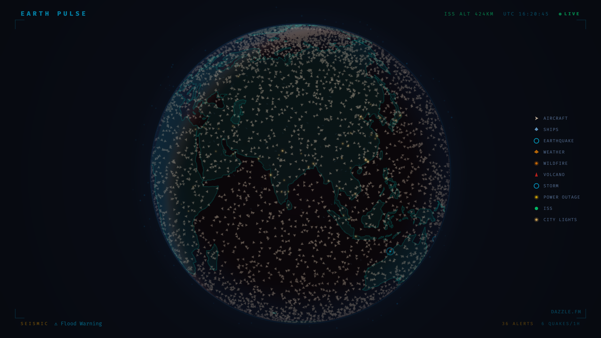

# Earth Pulse

A living globe powered by real-time seismic and orbital data. Earthquakes ripple across the surface, the ISS traces its orbit, and the planet breathes. GPU stage recommended.



## Run It

```bash
npm install
npm run dev
```

## Deploy It

```bash
npm run build
dazzle stage create earth-pulse --gpu
dazzle stage up --stage earth-pulse
dazzle stage sync ./dist --stage earth-pulse --watch
```

## What You'll See

A slowly rotating orthographic globe rendered with WebGL — dark surface, glowing graticule, atmosphere rim. Real-time earthquake data from USGS appears as expanding ripple rings (cyan < M3, amber M3–5, red M5+). The ISS traces a green orbital path. A status bar shows UTC time, ISS altitude, and a seismic event feed.

## Data Sources

- **Earthquakes** — [USGS GeoJSON Feed](https://earthquake.usgs.gov/earthquakes/feed/v1.0/geojson.php), polled every 60s
- **ISS Position** — [Where the ISS At](https://wheretheiss.at/), polled every 8s
