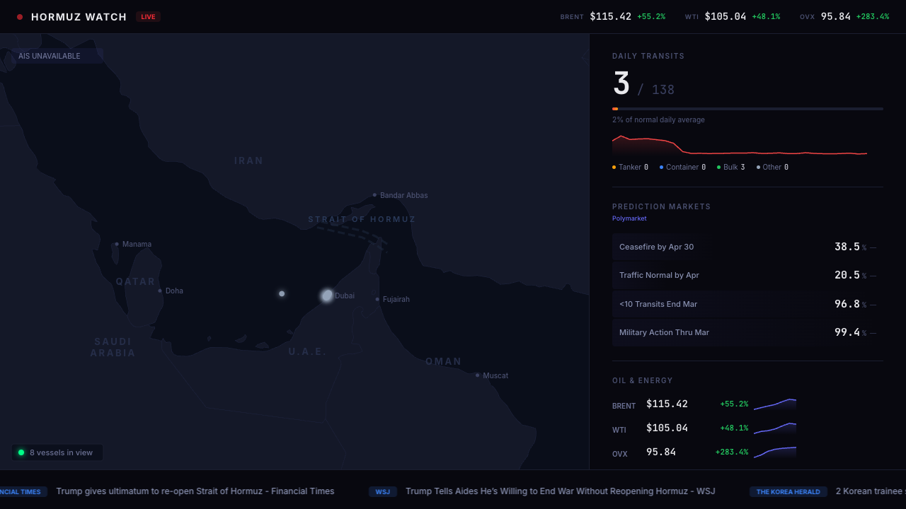

# Hormuz Watch

Real-time monitoring dashboard for the Strait of Hormuz crisis. Live vessel positions, prediction market prices, transit counts, oil data, and breaking news. All data is live.



## Run It

```bash
npm install
npm run dev
```

Set your AISStream API key (free from [aisstream.io](https://aisstream.io)):

```bash
echo 'VITE_AISSTREAM_API_KEY=your_key_here' > .env.local
```

## Deploy It

```bash
npm run build
dazzle stage create hormuz-watch
dazzle stage up --stage hormuz-watch
dazzle stage sync ./dist --stage hormuz-watch --watch
```

## What You'll See

A dark SVG map of the Persian Gulf with glowing vessel dots streaming in via AIS. The right panel shows daily transit counts (3/138 during the blockade), Polymarket prediction prices for ceasefire and traffic normalization, and oil price data. A news ticker scrolls real headlines from Google News and CENTCOM RSS.

Vessel positions accumulate over time and persist to localStorage across refreshes. After several hours of streaming, the map fills with dozens of tracked vessels.

## Data Sources

- **Vessel Positions** — [AISStream.io](https://aisstream.io) WebSocket, real-time terrestrial AIS
- **Transit Counts** — [IMF PortWatch](https://portwatch.imf.org/) ArcGIS API, daily chokepoint data
- **Prediction Markets** — [Polymarket](https://polymarket.com/) CLOB API, polled every 30s
- **Oil Prices** — [Yahoo Finance](https://finance.yahoo.com/) chart API, polled every 5min
- **News** — [Google News RSS](https://news.google.com/) + [CENTCOM RSS](https://www.centcom.mil/), polled every 5min

## Notes

- AISStream requires a free API key. Without it, the map shows no vessels but all other data works.
- Oil prices and news feeds require CORS to be disabled (Dazzle handles this). In local dev, the Vite proxy handles it automatically.
- AIS terrestrial coverage in the Persian Gulf is sparse. Vessels accumulate gradually; the 12-hour localStorage cache helps.
- Inject live headlines via Dazzle events: `dazzle stage event emit --stage hormuz-watch hormuz-headline '{"title":"...", "source":"...", "category":"news"}'`
