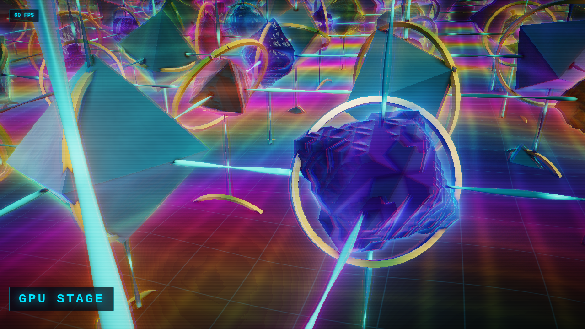

# Hyperstructure

Raymarched fractal lattice with procedural audio. An infinite field of morphing geometric structures -- hollow octahedra blending into Menger fractals, connected by pulsing data beams, floating above a reflective grid. Generative drone soundtrack evolves forever.



## Run It

```bash
npm install
npm run dev
```

## Deploy It

```bash
npm run build
dazzle stage create hyperstructure --gpu
dazzle stage up --stage hyperstructure
dazzle stage sync ./dist --stage hyperstructure --watch
```

## What You'll See

A camera swooping through an infinite warped lattice of fractal structures. Chromatic aberration splits the light. Energy rings orbit each cell. Data pulses flow along connecting beams. A generative drone soundtrack -- bass, sub, detuned pads, filtered noise, metallic ping echoes -- evolves in sync with the visuals.

Requires a GPU stage (`--gpu`) -- the shader runs 90-step raymarching with 3x chromatic aberration passes and a fractal SDF per pixel. Software rendering can't keep up.
