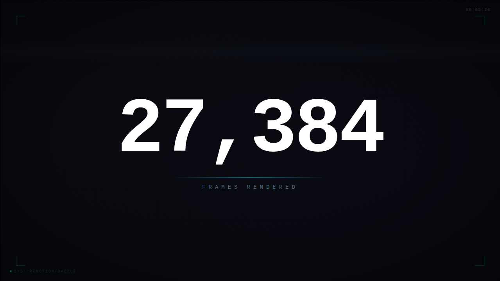

# Remotion Stream

Cinematic motion graphics built with [Remotion](https://remotion.dev), rendered in-browser, and broadcast through [Dazzle](https://dazzle.fm). Deterministic, frame-perfect animation -- every visual is a pure function of the current frame number.



## Prerequisites

- [Node.js](https://nodejs.org) 18+
- [Dazzle CLI](https://dazzle.fm) (`curl -sSL https://dazzle.fm/install.sh | sh`)

## Run It

```bash
npm install
npm start
```

## Deploy It

```bash
npm run build
dazzle stage create remotion-stream
dazzle stage up --stage remotion-stream
dazzle stage sync ./dist --stage remotion-stream --watch
```

## What You'll See

Five looping scenes with hard-cut transitions: signal lock with decoding text, a massive counting number, layered waveforms, typewriter title card, and orbital particles fading to black.
