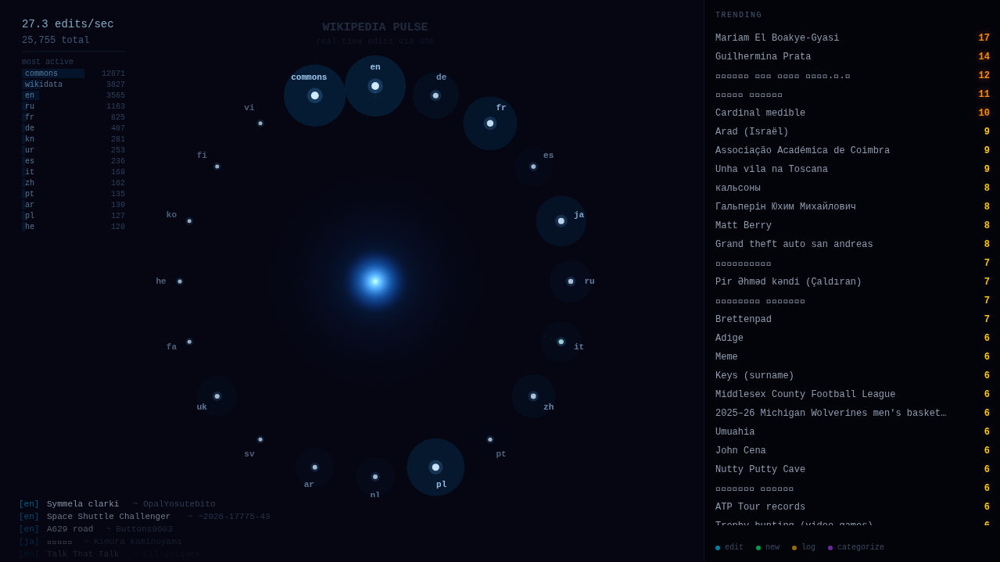

# Wikipedia Stream

Real-time visualization of Wikipedia edits as they happen. Connects to the Wikimedia EventStreams API and renders each edit as it flows in -- article name, editor, diff size, and edit type -- creating a living view of one of the internet's largest collaborative projects.



## Run It

```bash
npm install
npm run dev
```

## Deploy It

```bash
npm run build
dazzle stage create wikipedia-stream
dazzle stage up --stage wikipedia-stream
dazzle stage sync ./dist --stage wikipedia-stream --watch
```

## What You'll See

A real-time feed of Wikipedia edits streaming in from across the globe. Each edit shows the article title, the editor, whether it was a human or bot, and the size of the change. Additions glow green, deletions glow red, and the overall pace of edits pulses through the visualization like a heartbeat of collective knowledge.
